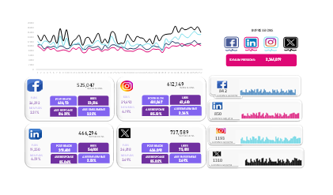

# 📊 Social Media Metrics Dashboard

  
*An interactive overview of your social media analytics, displaying key performance metrics and trends.*

---

## 🚀 Project Overview

This project provides a **Social Media Metrics Dashboard** that visualizes critical insights from platforms like Facebook, Instagram, LinkedIn, and email marketing. The dashboard includes:

- **Engagement metrics** for each platform.
- **Comparative performance** across time.
- **Detailed reach and impressions data.**

---

## 🖼️ Dashboard Preview

Below is a snapshot of the dashboard visualizing key performance metrics:



---

## 📌 Features

- **Interactive Charts**: Line charts and trend analysis to track performance.
- **Platform Metrics**:
  - 📘 Facebook
  - 📸 Instagram
  - 🔗 LinkedIn
  - ✉️ Email
- **Summary Statistics**: Quick view of reach, impressions, and engagement.

---

## 🛠️ Tools Used

- **Excel** Data cleaning and visualization using libraries like Pandas and Matplotlib.
 Data preprocessing and aggregation.
 To create an interactive, visually rich dashboard.

---

## 📂 Repository Structure

- `data/`: Contains raw and processed data files.
- `notebooks/`: Jupyter Notebooks for data cleaning and analysis.
- `dashboard-socialmedia.png`: Dashboard preview image.
- `README.md`: Project documentation (this file).

---

## ⚡ How to Use

1. **Clone the Repository**:
   ```bash
   git clone https://github.com/yourusername/social-media-metrics.git
   cd social-media-metrics
Run the Dashboard:
Open dashboard.pbix in Power BI Desktop to view the dashboard.
Customize it with your own data.
📊 Insights and Analysis
1. Engagement Trends
The dashboard highlights:

Daily and weekly engagement fluctuations.
Key drivers for audience interaction.
2. Platform Comparisons
Compare metrics across Facebook, Instagram, LinkedIn, and email to identify high-performing platforms.

3. Content Insights
Understand which type of content resonates most with your audience.

🌟 Contribute
We welcome contributions to enhance the dashboard or add features! Please submit a pull request or open an issue for discussions.

📞 Contact
Feel free to reach out if you have any questions:

📧 Email: marinaisaac253@gmail.com

